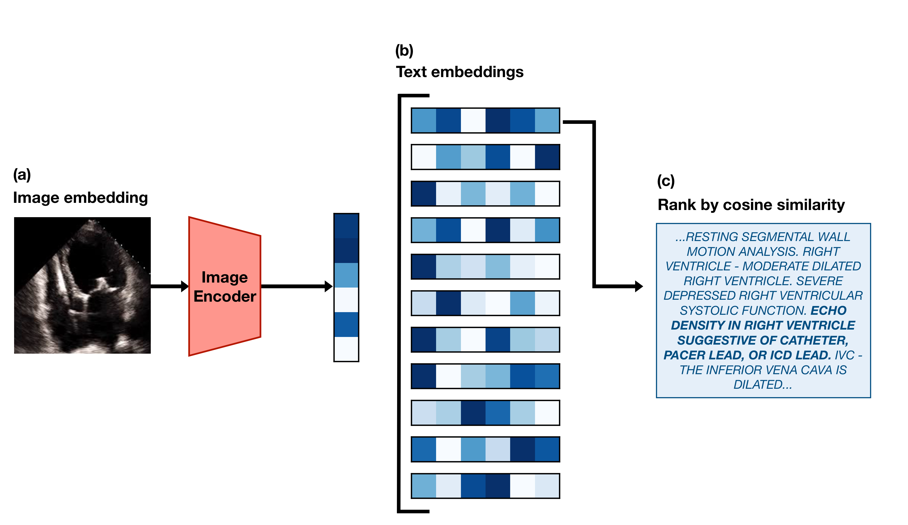

## Introduction



This post is a code-forward deep dive into EchoCLIP, a vision-language model for echocardiogram interpretation. The code repository for EchoCLIP is available on [GitHub](https://github.com/echonet/echo_CLIP) and the accompanying Nature paper is available [here](https://www.nature.com/articles/s41591-024-02959-y).

EchoCLIP learns the relationship between echo images and text interpretations by expert cardiologists. It is trained on 1,032,975 cardiac ultrasound videos and corresponding text and can assess cardiac function and identify implanted intracardiac devices. 

## Initialization of EchoCLIP

```{python}
echo_clip, _, preprocess_val = create_model_and_transforms(
    "hf-hub:mkaichristensen/echo-clip", precision="fp32", device="cpu"
)
```

`create_model_and_transforms()` is a function from the [`open_clip` library](https://github.com/mlfoundations/open_clip) that loads a pretrained CLIP model from Hugging Face Hub, `hf-hub:mkaichristensen/echo-clip`, sets it to 32-bit precision, and runs it on a CPU. The function returns the model configuration, `echo_clip`, and the preprocessing transformations for validation, `preprocess_val`, which will be used later to preprocess the video frames before feeding them into the model.


## Video Embedding

```{python}
test_video = read_avi(
    "example_video.avi",
    (224, 224),
)
test_video = torch.stack(
    [preprocess_val(T.ToPILImage()(frame)) for frame in test_video], dim=0
)
test_video = test_video[0:min(40, len(test_video)):2]
```

The code above reads an example echocardiogram video, preprocesses each frame using the validation transformations defined in `preprocess_val`, and selects every other frame up to a maximum of 40 frames. The resulting `test_video` tensor has shape `(20, 3, 224, 224)`, where 20 is the number of frames, 3 is the number of color channels (RGB), and 224x224 is the spatial resolution of each frame.

```{python}
test_video_embedding = F.normalize(echo_clip.encode_image(test_video), dim=-1)
```

First, the preprocessed video frames are passed through the CLIP image encoder, `echo_clip.encode_image()`, to obtain a video embedding. The video embedding has a shape of `(20, 512)`, where 20 is the number of frames and 512 is the dimensionality of the embedding space. Each frame is represented as a 512-dimensional vector. The resulting embedding is then normalized using `F.normalize()` along the last dimension (feature dimension) to ensure that each embedding vector has unit length.

Cosine similarity is `(A · B) / (||A|| * ||B||)` and when `A` and `B` are normalized to unit length, this simplifies to `A · B`, which is just the dot product of the two vectors. The dot product operation alone is much cheaper than calculating the full cosine similarity with unnormalized vectors. `A` would be the test video embedding and `B` would be the prompt embedding.


## Text Embedding

```{python}
pacemaker_prompts = tokenize(pacemaker_prompts).cpu()
```

We use the CLIP BPE tokenizer to tokenize the pacemaker prompts.

```
['ECHO DENSITY IN RIGHT VENTRICLE SUGGESTIVE OF CATHETER, PACER LEAD, OR ICD LEAD. ',
 'ECHO DENSITY IN RIGHT ATRIUM SUGGESTIVE OF CATHETER, PACER LEAD, OR ICD LEAD. ']
```

and then move the tokenized prompts to the CPU for later use in calculating similarity with the video embedding.

```{python}
pacemaker_prompt_embeddings = F.normalize(
    echo_clip.encode_text(pacemaker_prompts), dim=-1
)
```

We then encode the tokenized pacemaker prompts using the CLIP text encoder and normalize the resulting embeddings for later use in calculating cosine similarity with the video embedding.

```{python}
pacemaker_predictions = compute_binary_metric(
    test_video_embedding, pacemaker_prompt_embeddings
)
```

We compute the binary metric for pacemaker presence by calculating the cosine similarity between the video embedding and the pacemaker prompt embeddings. The `compute_binary_metric` function is defined as follows:

```{python}
def compute_binary_metric(
    video_embeddings: torch.Tensor,
    prompt_embeddings: torch.Tensor,
):
    per_frame_similarities = video_embeddings @ prompt_embeddings.T
    # Average along the candidate dimension and frame dimension
    predictions = per_frame_similarities.mean(dim=-1).mean(dim=-1)

    return predictions
```

The function calculates the cosine similarity between the video embeddings and the prompt embeddings by performing a matrix multiplication (dot product) between the video embeddings and the transposed prompt embeddings. This results in a tensor of shape `(batch_size, num_frames, num_prompts)`. The function then averages the similarities across both the candidate dimension (e.g., if there are 2 pacemaker prompts, their similarities are averaged into one score per frame) and the frame dimension (collapses all frame-level scores into one score per video) to produce a single prediction score for each video in the batch.


## Predicting Continuous Values

```{python}
ejection_fraction_prompts = zero_shot_prompts["ejection_fraction"]
```

```
['THE LEFT VENTRICULAR EJECTION FRACTION IS ESTIMATED TO BE <#>% ',
 'LV EJECTION FRACTION IS <#>%. ']
```

Ejection fraction can range from 0% to 100%, so we make 100 versions of each prompt, replacing `<#>` with each integer from 0 to 100. 

```{python}
ejection_fraction_prompts = tokenize(ejection_fraction_prompts).cpu()
ejection_fraction_embeddings = F.normalize(
    echo_clip.encode_text(ejection_fraction_prompts), dim=-1
)
```

Once again, we tokenize the ejection fraction prompts and encode them using the CLIP text encoder, normalizing the resulting embeddings for later use in calculating cosine similarity with the video embedding.

```{python}
ejection_fraction_predictions = compute_regression_metric(
    test_video_embedding, ejection_fraction_embeddings, prompt_values
)
```

The `compute_regression_metric` function is defined as follows:

```{python}
def compute_regression_metric(
    video_embeddings: torch.Tensor,
    prompt_embeddings: torch.Tensor,
    prompt_values: torch.Tensor,
):
    per_frame_similarities = (
        video_embeddings @ prompt_embeddings.T
    )  # (N x Frames x Candidates)

    # Sort the candidates by their similarity to the video
    ranked_candidate_phrase_indices = torch.argsort(
        per_frame_similarities, dim=-1, descending=True
    )

    # Convert matrix of indices to their corresponding continuous values.
    prompt_values = torch.tensor(
        prompt_values, device=video_embeddings.device
    )  # (N x Frames x Candidates)
    all_frames_ranked_values = prompt_values[ranked_candidate_phrase_indices]

    # Taking the mean along dim=1 collapses the frames dimension
    avg_frame_ranked_values = all_frames_ranked_values.float().mean(
        dim=1
    )  # (N x Candidates)

    # The median of only the top 20% of predicted values is taken
    # as the final predicted value
    twenty_percent = int(avg_frame_ranked_values.shape[1] * 0.2)
    final_prediction = avg_frame_ranked_values[:, :twenty_percent].median(dim=-1)[0]

    return final_prediction
```

The function calculate the cosine similarity between the video embeddings and the prompt embeddings, resulting in a tensor of shape `(20, 2)`, equivalent to  `(num_frames, num_prompts)`. The candidates (prompts) are then ranked by their similarity to the video for each frame. The corresponding continuous values for each prompt are retrieved and averaged across frames. Finally, the median of the top 20% of predicted values is taken as the final predicted value for each video in the batch.


## Conclusion

In this post, we walked through the EchoCLIP codebase — from model initialization with pre-trained weights, to video and text embedding, to calculating similarity for both binary classification and regression tasks. EchoCLIP is a powerful vision-language model that can learn complex relationships between echocardiogram videos and their corresponding text interpretations, enabling it to perform a variety of tasks such as assessing cardiac function and identifying implanted devices.


