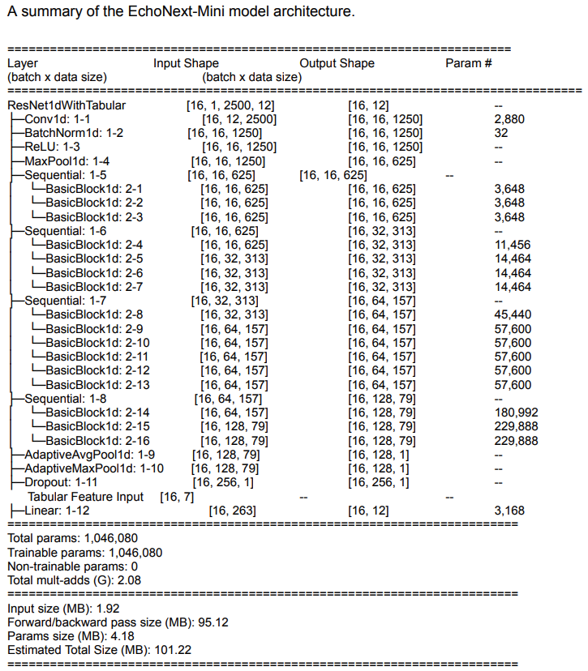
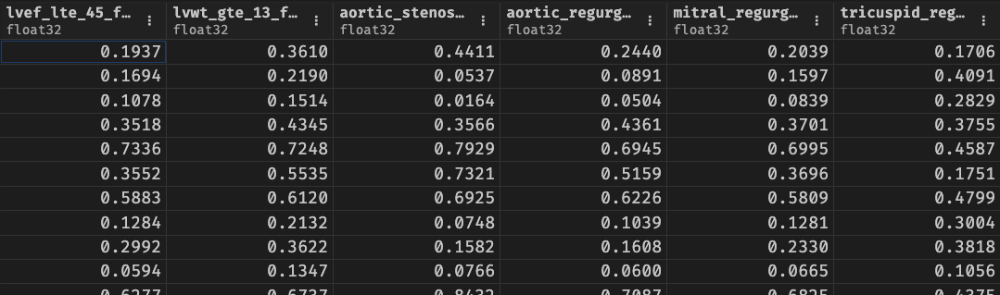

## Introduction

This post is a code-focused deep dive into an electrocardiographic deep learning model called [EchoNext-Mini](https://ai.nejm.org/doi/10.1056/AIdbp2500516). EchoNext-Mini detects structural heart disease (SHD) from a 12-lead ECG by combining two inputs: the raw ECG waveforms and a handful of tabular features including age, sex, heart rate, PR interval, QRS duration, and corrected QT interval. It outputs 12 disease probabilities per ECG.

#### Model Architecture



The model architecture is a 1D adaptation of ResNet-34 taking a 12-lead ECG as input with the final layer modified to accept tabular features alongside the learned ECG features. The final layer outputs 12 logits, with 1 detecting composite SHD and the other 11 detecting individual structural heart disease (SHD) subdiagnoses. The model was trained and evaluated on the [EchoNext-Mini dataset](https://physionet.org/content/echonext/1.1.1/) and outputs a probability between 0 and 1. 

In the rest of this post, we will go through the EchoNext-Mini [source code](https://github.com/howardbaik/IntroECG/tree/master/7-EchoNext%20Minimodel), which is implemented in PyTorch, and explain how the model works. On a high-level, the code is organized into two main classes: `BasicBlock1d` and `ResNet1dWithTabular`.

## The `BasicBlock1d` class

The `BasicBlock1d` class implements the pieces of a Residual Block (shown in the model architecture diagram) that make up the EchoNext-Mini model architecture. It is a 1D adaptation of the original ResNet basic block, which was designed for 2D images. The `BasicBlock1d` class has two convolutional layers, each followed by batch normalization and ReLU activation. It also includes a "skip connection" that adds the input to the output of the second convolutional layer. 

### The `__init__()` method

The `BasicBlock1d` class is first initialized with `nn.Conv1d`, which is PyTorch's 1D convolution layer - it slides learnable filters along a single dimension (time) instead of over a 2D image. It slides the filters with the parameters `stride`, `padding`, and `kernel_size`. Also, it is initialized with `nn.BatchNorm1d` for batch normalization, `nn.ReLU` for ReLU, and `nn.Dropout` for Dropout. 

```{python}
class BasicBlock1d(nn.Module):
    expansion = 1
    def __init__(
        self,
        inplanes: int,
        planes: int,
        stride: int = 1,
        downsample: Optional[float] = None,
        dropout: float = 0.5,
        kernel_size: int = 7,
        padding: int = 3,
        bias: bool = False,
        inplace: bool = True,
    ):
        super().__init__()
        self.conv1 = nn.Conv1d(
            inplanes, planes, kernel_size=kernel_size, stride=stride, padding=padding, bias=bias
        )
        self.bn1 = nn.BatchNorm1d(planes)
        self.relu = nn.ReLU(inplace=inplace)
        self.dropout = nn.Dropout(p=dropout)
        self.conv2 = nn.Conv1d(
            planes, planes, kernel_size=kernel_size, stride=1, padding=padding, bias=bias
        )
        self.bn2 = nn.BatchNorm1d(planes)
        self.downsample = downsample
```

### The `forward()` method

The `forward()` method defines how data flows through the `BasicBlock1d` class. First, its saves the input as `residual` so it can be added back later ("skip connection"). Then, it goes through the first conv stage - 1-D convolution, batch norm, ReLU, and dropout. Then, the second conv stage involves another 1-D convolution and then batch normalization. The final residual addition only works if the `out` and `x` have identical shapes. In the case where the shapes don't match, `self.downsample` projects the original input `x` to the new shape. Note that unlike the first conv stage, there's no ReLU activation right after the batch norm. The ReLU activation is deliberately deferred until after the residual addition, which is the classic ResNet ordering. 

```{python}
def forward(self, x: torch.Tensor) -> torch.Tensor:
    residual = x
    out = self.conv1(x)
    out = self.bn1(out)
    out = self.relu(out)
    out = self.dropout(out)
    out = self.conv2(out)
    out = self.bn2(out)
    if self.downsample is not None:
        residual = self.downsample(x)
    out += residual
    out = self.relu(out)
    return out
```


## The `ResNet1dWithTabular` class

The `ResNet1dWithTabular` class is the top-level class representing the architecture of the EchoNext-Mini model. It is a ResNet-34 model adapted to 1D signals (12-lead ECG waveforms), and implements the entire model architecture shown in the diagram above. The model takes two inputs: a 12-lead ECG and a vector of tabular features (e.g., age, sex, heart rate, PR interval, QRS duration, corrected QT interval). The model outputs 12 logits, with 1 detecting composite SHD and the other 11 detecting individual structural heart disease (SHD) subdiagnoses.

### The `__init__()` method

The `ResNet1dWithTabular` class has the following constructor parameters:

- `len_tabular_feature_vector`: Number of tabular features to be appended before the output layer.
- `filter_size=64`: Number of channels after the first conv; each subsequent stage doubles it (64 → 128 → 256 → 512).
- `input_channels=12`: The 12 ECG leads.
- `dropout_value=0.5`: Dropout rate used both inside every residual block and before the final layer.
- `num_classes=1`: A single logit, i.e., binary classification.
- `conv1_kernel_size=15`, `conv1_stride=2`, `padding=7`: The convolution parameters: a wide kernel (15 samples) to capture ECG morphology, stride 2 halves the time dimension, and padding 7 = (15−1)/2 keeps "same" length otherwise.
- `bias=False`: Convolutions skip their bias term because the batch norm right after each conv has its own learnable shift, making a conv bias redundant.

Then, it stores these parameters in `self`:

- `self.inplanes = filter_size`: Current channel count
- `self.layers = [3, 4, 6, 3]`: The number of blocks per stage. This 3-4-6-3 pattern comes from ResNet-34.
- `self.conv1`:The stem convolution that maps the 12 ECG leads to 64 channels.
- `self.layer1`, `self.layer2`, `self.layer3`, `self.layer4`: The four residual stages
- `self.adaptiveavgpool` and `self.adaptivemaxpool`:Two adaptive pools that each collapse the entire time axis to a single value per channel. The average pool signifies the "overall level" of each feature and the max pool the "strongest occurrence" of each feature.
- `self.output`: The final linear layer, where the input width is `8 * filter_Size * expansion * 2 + len_tabular_feature_vector` and the output width is `num_classes` (A single logit for binary classification of structural heart disease). 


Breaking down the input dimension term by term:

- `8 * filter_size`: The number of channels coming out of `layer4`. The channel count doubles at each ResNet stage (filter_size → 2× → 4× → 8×, see lines 78–81), so with the default filter_size=64 the last stage outputs 512 channels.
- `* BasicBlock1d.expansion` — expansion is 1 for basic blocks, so this is a no-op here. It's kept for ResNet convention: if you swapped in bottleneck blocks (expansion = 4), the layer would resize automatically.
- `* 2` - The forward pass pools the feature map two ways, with `adaptiveavgpool` and `adaptivemaxpool` (each producing 512 values), and concatenates them at line 129 (`torch.cat((x1, x2), dim=1)`). That gives 1024 ECG-derived features.
- `+ len_tabular_feature_vector` — The tabular features (e.g., age, sex, ECG measurements) are concatenated onto that flattened vector.

The output size is `num_classes` (default `1`, i.e., a single logit for binary classification of structural heart disease).


```{python}
def __init__(
        self,
        len_tabular_feature_vector: int,
        filter_size: int = 64,
        input_channels: int = 12,
        dropout_value: float = 0.5,
        num_classes: int = 1,
        conv1_kernel_size: int = 15,
        conv1_stride: int = 2,
        padding: int = 7,
        bias: bool = False,
    ):
    super().__init__()
    self.inplanes = filter_size
    self.layers = [3, 4, 6, 3]
    self.conv1 = nn.Conv1d(
        input_channels,
        self.inplanes,
        kernel_size=conv1_kernel_size,
        stride=conv1_stride,
        padding=padding,
        bias=bias,
    )
    self.dropout_value = dropout_value
    self.bn1 = nn.BatchNorm1d(self.inplanes)
    self.relu = nn.ReLU(inplace=True)
    self.maxpool = nn.MaxPool1d(kernel_size=3, stride=2, padding=1)
    self.layer1 = self._make_layer(BasicBlock1d, filter_size, self.layers[0])
    self.layer2 = self._make_layer(BasicBlock1d, 2 * filter_size, self.layers[1], stride=2)
    self.layer3 = self._make_layer(BasicBlock1d, 4 * filter_size, self.layers[2], stride=2)
    self.layer4 = self._make_layer(BasicBlock1d, 8 * filter_size, self.layers[3], stride=2)
    self.adaptiveavgpool = nn.AdaptiveAvgPool1d(1)
    self.adaptivemaxpool = nn.AdaptiveMaxPool1d(1)
    self.output = nn.Linear(
        8 * filter_size * BasicBlock1d.expansion * 2 + len_tabular_feature_vector, num_classes
    )
    self.dropout = nn.Dropout(dropout_value)
```


### The `forward()` method

The forward method takes a 12-lead ECG and a vector of tabular features (e.g., age, sex, ECG measurements) as input. The ECG is first reshaped from `[BATCH_SIZE, 1, FEATURE_SIZE, 12]` to `[BATCH_SIZE, 12, FEATURE_SIZE]` for the 1D convolutions. Then, it goes through the stem convolution and the four residual layers that are built by `_make_layer`. Each stage doubles the number of channels and halves the time dimension. After the last residual layer, the feature map is pooled in two ways (average and max), flattened, and concatenated with the tabular features. Finally, it goes through a linear layer to produce the `num_classes` logits. 


```{python}
def forward(self, x_and_tabular: Tuple[torch.Tensor, torch.Tensor]) -> torch.Tensor:
    x, tabular = x_and_tabular

    # Reshape x from [BATCH_SIZE, 1, FEATURE_SIZE, 12]
    # to [BATCH_SIZE, 12, FEATURE_SIZE] for the 1d convolutions
    x = torch.transpose(x, 2, 3)
    x = torch.squeeze(x, 1)

    # Stem
    x = self.conv1(x)
    x = self.bn1(x)
    x = self.relu(x)
    x = self.maxpool(x)

    # Residual layers
    x = self.layer1(x)
    x = self.layer2(x)
    x = self.layer3(x)
    x = self.layer4(x)

    # Pool (avg + max), flatten, and concat with tabular features
    x1 = self.adaptiveavgpool(x)
    x2 = self.adaptivemaxpool(x)
    x = torch.cat((x1, x2), dim=1)
    x = self.dropout(x)
    x = x.view(x.size(0), -1)
    x = torch.cat((x, tabular), dim=1)

    out = self.output(x)
    return torch.squeeze(out, 1)
```


## Demo

To see the model in action, I grabbed the demo data from PhysioNet's [EchoNext: A Dataset for Detecting Echocardiogram-Confirmed Structural Heart Disease from ECGs](https://physionet.org/content/echonext/1.1.1/). The validation set comes in two files: the ECG waveforms (`EchoNext_val_waveforms.npy`, 1.2 GB) and the accompanying tabular features such as age, sex, and ECG measurements (`EchoNext_val_tabular_features.npy`, 253 KB).

With the data in hand, I ran the inference script to compute, for every ECG in the validation set, the probability of each of the 12 structural heart diseases:

```
.venv/bin/python -m cradlenet.scripts.inference.ecg_tabular \
    --features_path physionet/EchoNext_val_waveforms.npy \
    --tabular_path physionet/EchoNext_val_tabular_features.npy \
    --legacy echonext \
    --batch_size 256 --num_workers 0 \
    --write_outputs --output_dir results/physionet_val/ \
    --num_classes 12 --len_tabular_feature_vector 7 --filter_size 16 \
    --binary \
    --progbar \
    --checkpoint models/echonext_multilabel_minimodel/weights.pt
```

The output, `probs.npy` is a numpy array of shape `[NUM_ECGS, 12]` containing the predicted probabilities for each of the 12 structural heart diseases. 

