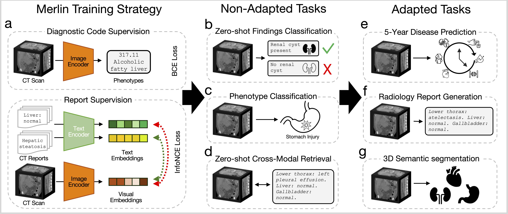
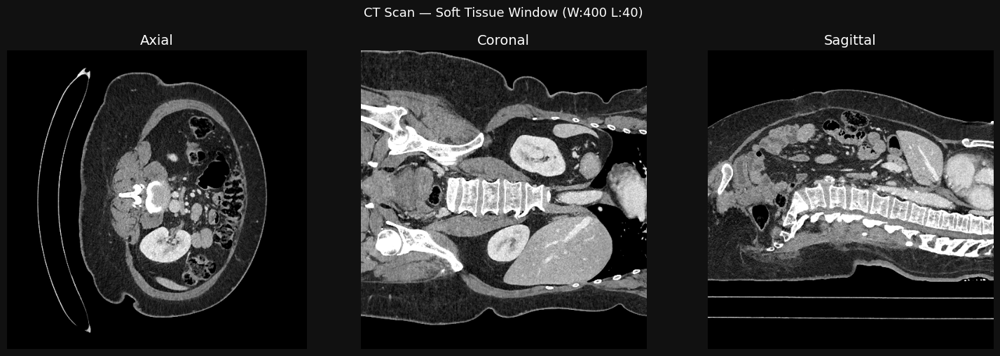

## Introduction



This post is a code-first deep dive into a foundation model called Merlin that leverages the structured and unstructured EHR within hospitals to train an abdominal CT visual model. The authors officially describe Merlin as a "_3D VLM for computed tomography that leverages both structured electronic health records (EHR) and unstructured radiology reports for pretraining._" The code repository for Merlin is on [GitHub](https://github.com/StanfordMIMI/Merlin) and the accompanying Nature paper is [here](https://www.nature.com/articles/s41586-026-10181-8).

Merlin is evaluated on non-adapted and adapted tasks. The non-adapted tasks include zero-shot classification, phenotype classification, and zero-shot cross-modal retrieval. The adapted tasks include 5-year disease prediction, radiology report generation, and 3D segmentation.

### MerlinArchitecture

We dive into the [source code](https://github.com/StanfordMIMI/Merlin/blob/main/merlin/models/build.py) for the `MerlinArchitecture` class, which is the core architecture of the Merlin model. The `MerlinArchitecture` class uses two sub-classes, TextEncoder and ImageEncoder:

#### Text Encoder
```{python}
class TextEncoder(nn.Module):
    def __init__(self):
        super().__init__()
        self.tokenizer = AutoTokenizer.from_pretrained("yikuan8/Clinical-Longformer")
        self.text_encoder = AutoModel.from_pretrained("yikuan8/Clinical-Longformer")
        self.text_encoder.gradient_checkpointing_enable()
        self.linear_layer = nn.Linear(768, 512)

    def forward(self, text_labels):
        text_labels = [sanitize_report(text) for text in text_labels]
        inputs = self.tokenizer(
            text_labels,
            return_tensors="pt",
            padding=True,
            truncation=True,
            max_length=1024,
        )
        inputs = {k: v.to(self.text_encoder.device) for k, v in inputs.items()}
        text_embeddings = self.text_encoder(**inputs).last_hidden_state[:, 0, :]
        text_embeddings = self.linear_layer(text_embeddings)
        return text_embeddings
```

The `TextEncoder` class uses a pretrained Clinical-Longformer model (`yikuan8/Clinical-Longformer`) to encode radiology report text into embeddings. The forward method takes in a list of text labels (radiology reports), sanitizes them, tokenizes them, and passes them through the Clinical-Longformer to obtain text embeddings. The resulting embeddings are then passed through a linear layer to reduce their dimensionality from 768 to 512.

#### ImageEncoder
```{python}
class ImageEncoder(nn.Module):
    def __init__(
        self,
        ImageEmbedding: bool = False,
        PhenotypeCls: bool = False,
        FiveYearPred: bool = False,
    ):
        super().__init__()
        self.ImageEmbedding = ImageEmbedding
        self.PhenotypeCls = PhenotypeCls
        self.FiveYearPred = FiveYearPred
        resnet = torchvision.models.resnet152(pretrained=True)
        self.i3_resnet = i3res.I3ResNet(
            copy.deepcopy(resnet),
            class_nb=1692 if not self.FiveYearPred else 6,
            conv_class=True,
            ImageEmbedding=self.ImageEmbedding,
            PhenotypeCls=self.PhenotypeCls,
            FiveYearPred=self.FiveYearPred,
        )

    def forward(self, image):
        if self.ImageEmbedding:
            contrastive_features = self.i3_resnet(image)
            return contrastive_features
        elif self.PhenotypeCls:
            return self.i3_resnet(image)
        elif self.FiveYearPred:
            return self.i3_resnet(image)
        else:
            contrastive_features, ehr_features = self.i3_resnet(image)
            return contrastive_features, ehr_features

```

The three flags `ImageEmbedding`, `PhenotypeCls`, `FiveYearPred` select one of Merlin's evaluation/inference modes from the paper. `ImageEmbedding` mode produces a contrastive image embedding for retrieval tasks. `PhenotypeCls` mode produces multi-label phenotype predictions for EHR tasks over 1,692 hierarchical PheWAS phenotypes. `FiveYearPred` mode produces multi-label disease predictions for 5-year disease prediction tasks over 6 diseases. The default — all `False` — gives you the full multi-task pretraining output. 

The `ImageEmbedding` mode passes the input image through the `i3_resnet` and returns the contrastive features for retrieval tasks. The `PhenotypeCls` mode passes the input image through the `i3_resnet` and returns the 1692-dim multi phenotype predictions for EHR tasks. `FiveYearPred` mode passes the input image through the i3_resnet and returns the 6-dim multi disease predictions for 5-year disease prediction tasks. Finally, the default mode (all flags `False`) passes the input image through the i3_resnet and returns both the contrastive features and the EHR phenotype predictions, which is the full output of Merlin's multi-task pretraining.


#### MerlinArchitecture

```{python}
class MerlinArchitecture(nn.Module):
    def __init__(
        self,
        init_logit_scale: float = 1.0,
        ImageEmbedding: bool = False,
        PhenotypeCls: bool = False,
        FiveYearPred: bool = False,
    ):
        super().__init__()
        self.ImageEmbedding = ImageEmbedding
        self.PhenotypeCls = PhenotypeCls
        self.FiveYearPred = FiveYearPred
        self.encode_image = ImageEncoder(
            ImageEmbedding=self.ImageEmbedding,
            PhenotypeCls=self.PhenotypeCls,
            FiveYearPred=self.FiveYearPred,
        )
        self.encode_text = TextEncoder()
        self.logit_scale = nn.Parameter(torch.ones([]) * init_logit_scale)

    def forward(self, image, text=None):
        if self.ImageEmbedding and text is None:
            image_features = self.encode_image(image)
            return image_features
        elif self.PhenotypeCls and text is None:
            phenotype_features = self.encode_image(image)
            return phenotype_features
        elif self.FiveYearPred and text is None:
            five_year_features = self.encode_image(image)
            return five_year_features
        ...
        ...
        ...
        return (
            image_features,
            ehr_features,
            text_features,
        )
```

The `MerlinArchitecture` class combines the `TextEncoder` and `ImageEncoder` to create the full Merlin model. The `__init__` method initializes the three mutually-exclusive mode flags(`ImageEmbedding`, `PhenotypeCls`, `FiveYearPred`) and creates instances of the `TextEncoder` and `ImageEncoder` with the appropriate flags. Also, it creates a temperature parameter for contrastive learning.

The `forward` method is essentially a mode dispatcher with input validation. It checks which mode is active based on the flags and processes the input accordingly:

- If `ImageEmbedding` mode is active, it processes the input image through the `ImageEncoder` and returns the contrastive features.
- If `PhenotypeCls` mode is active, it processes the input image through the `ImageEncoder` and returns the phenotype predictions.
- If `FiveYearPred` mode is active, it processes the input image through the `ImageEncoder` and returns the disease predictions.
- If none of the mode flags are active, it processes the input image through the `ImageEncoder` to get both the contrastive features and the EHR phenotype predictions, and returns both. Also, if text labels are provided, it processes them through the `TextEncoder` to get text embeddings and returns those as well.


## Demo

To run `demo.py`, we borrow a `gpu_1x_a100_sxm4` instance (1 A100 GPU with 40GB of VRAM) from Lambda Cloud, which currently costs $1.99/hour. The model loads and runs on this instance without any out-of-memory errors, demonstrating that Merlin can be trained and run on a single GPU.

###### Sample image of an CT scan:



<br>

###### Sample radiology report:

```
Lower thorax:         A small low-attenuating fluid structure is noted in the right cardiophrenic
                      angle, in keeping with a tiny pericardial cyst.
Liver and biliary:    Normal.
Gallbladder:          Normal.
Spleen:               Normal.
Pancreas:             Normal.
Adrenal glands:       Normal.
Kidneys and ureters:  Symmetric enhancement and excretion of the bilateral kidneys, with no
                      striated nephrogram to suggest pyelonephritis. Urothelial enhancement
                      bilaterally, consistent with urinary tract infection. No renal/ureteral
                      calculi. No hydronephrosis.
GI tract:             Normal. Normal gas-filled appendix.
Peritoneal cavity:    No free fluid.
Bladder:              Marked urothelial enhancement consistent with cystitis.
Uterus and ovaries:   Normal.
Vasculature:          Patent.
Lymph nodes:          Normal.
Abdominal wall:       Normal.
Musculoskeletal:      Degenerative change of the spine.
```

### Default: Contrastive Embeddings + Phenotype Predictions 

```{python}
model = Merlin()
model.eval()
model.cuda()
```

The [`Merlin` class](https://github.com/StanfordMIMI/Merlin/blob/main/merlin/models/load.py#L32) is a wrapper around the `MerlinArchitecture` that we defined earlier. It provides a convenient interface for loading the appropriate model configuration based on the task and for performing inference with the model. The model configurations are listed in [`MODEL_CONFIGS`](https://github.com/StanfordMIMI/Merlin/blob/main/merlin/models/load.py#L12-L29), where the default configuration uses the `MerlinArchitecture` with the checkpoint for the default task, the `report_generation` configuration uses the `Clip3DForTextGeneration` architecture with its corresponding checkpoint, and the `five_year_disease_prediction` configuration uses the `MerlinArchitecture` with a different checkpoint specific to that task. The appropriate model is loaded based on the flags set for the task.


```{python}
for batch in dataloader:
    outputs = model(batch["image"].to(device), batch["text"])
    print("\n================== Output Shapes ==================")
    print(f"Contrastive image embeddings shape: {outputs[0].shape}")
    print(f"Phenotype predictions shape:        {outputs[1].shape}")
    print(f"Contrastive text embeddings shape:  {outputs[2].shape}")
```

In this loop, we iterate over batches of data from a dataloader. For each batch, we pass the images and text through the model to get the outputs. We then print the shapes of the contrastive image embeddings, phenotype predictions, and contrastive text embeddings to verify that the model is producing outputs in the expected format. The `batch["image"]` is moved to the same device as the model (GPU) before being passed through the model. The outputs are expected to be a tuple containing the contrastive image embeddings, the phenotype predictions, and the contrastive text embeddings, which we print the shapes of for verification. This allows us to confirm that the model is correctly processing the input data and producing outputs of the expected dimensions.

```
================== Output Shapes ==================
Contrastive image embeddings shape: torch.Size([1, 512])
Phenotype predictions shape:        torch.Size([1, 1692])
Contrastive text embeddings shape:  torch.Size([1, 512])
```


### Image Embeddings
```{python}
model = Merlin(ImageEmbedding=True)
model.eval()
model.cuda()

for batch in dataloader:
    outputs = model(batch["image"].to(device))
    print("\n================== Output Shapes ==================")
    print(f"Image embeddings shape (Can be used for downstream tasks): {outputs[0].shape}")
```

In this loop, we initialize the `Merlin` model with the `ImageEmbedding` flag set to `True`, which configures the model to produce contrastive image embeddings. We then set the model to evaluation mode and move it to the GPU. As we iterate over batches of data from the dataloader, we pass only the images through the model (since we are only interested in the image embeddings in this configuration) and print the shape of the resulting image embeddings.

```
================== Output Shapes ==================
Image embeddings shape (Can be used for downstream tasks): torch.Size([1, 2048])
```


### Phenotype Predictions

In this mode, the `Merlin` model obtains phenotype predictions from the input images. It finds the top 3 predicted phenotypes from the model's output and prints them in a readable format:

```
Top 3 predicted phenotypes:
┏━━━━━━━━━━━━┳━━━━━━━━━━━━━━━━━━━━━━━━━━━━━━━━┳━━━━━━━━━━━━━┓
┃ Phencode   ┃ Phecode Description            ┃ Probability ┃
┡━━━━━━━━━━━━╇━━━━━━━━━━━━━━━━━━━━━━━━━━━━━━━━╇━━━━━━━━━━━━━┩
│ 785.0      │ Abdominal pain                 │ 0.9017      │
│ 1010.0     │ Other tests                    │ 0.6313      │
│ 1010.7     │ Persons with potential health  │ 0.4420      │
│            │ hazards related to             │             │
│            │ socioeconomic, psychosocial,   │             │
│            │ and other circumstances        │             │
└────────────┴────────────────────────────────┴─────────────┘
```


### Five-Year Disease Predictions

In this mode, the model obtains five-year disease predictions. It passes the CT image through the Merlin model configured for five-year disease prediction and prints the predicted probabilities for each of the six diseases in a readable format. The output shows the predicted probability of developing each disease within five years based on the input CT image. 

```
Five year disease prediction probabilities:
┏━━━━━━━━━━━━━━━━━━━━━━━━━━━┳━━━━━━━━━━━━━┓
┃ Disease                   ┃ Probability ┃
┡━━━━━━━━━━━━━━━━━━━━━━━━━━━╇━━━━━━━━━━━━━┩
│ Cardiovascular Disease    │      0.4248 │
│ (CVD)                     │             │
│ Ischemic Heart Disease    │      0.2856 │
│ (IHD)                     │             │
│ Hypertension (HTN)        │      0.5327 │
│ Diabetes Mellitus (DM)    │      0.3722 │
│ Chronic Kidney Disease    │      0.3814 │
│ (CKD)                     │             │
│ Chronic Liver Disease     │      0.2831 │
│ (CLD)                     │             │
└───────────────────────────┴─────────────┘
```


### Radiology report Generation

In [`report_generation_demo.py`](https://github.com/StanfordMIMI/Merlin/blob/main/documentation/report_generation_demo.py), the `Merlin` model is initialized with the `report_generation` configuration, which swaps in the `Clip3DForTextGeneration` architecture — a vision-to-text model that generates radiology reports from 3D medical images. Passing CT images through this model produces full radiology reports, letting us see how coherent and clinically relevant Merlin's generated text is.


```
Merlin Radiology Report:
Lower thorax:            Normal.
Liver and biliary tree:  Normal.
Gallbladder:             Normal.
Spleen:                  Normal.
Pancreas:                Normal.
Adrenal glands:          Normal.
Kidneys and ureters:     Normal.
Gastrointestinal tract:  No evidence of bowel obstruction. Normal appendix
                         (3/297).
Peritoneal cavity:       No free fluid.
Abdominal wall:          Normal.
Bladder:                 Normal.
Uterus and ovaries:      The uterus is surgically absent with bilateral
                         salpingo-oophorectomy.
Vasculature:             Patent.
Lymph nodes:             Normal.
Musculoskeletal:         Normal.
```


## Conclusion

Merlin is a foundation model for abdominal CT that leverages both structured and unstructured EHR data to produce versatile outputs for a variety of tasks. By understanding the architecture and how to use the model for different inference modes, we can see how Merlin can be applied to real-world clinical problems, from phenotype prediction to radiology report generation. The ability to run Merlin on a single GPU also makes it accessible for researchers and practitioners looking to explore its capabilities further.


