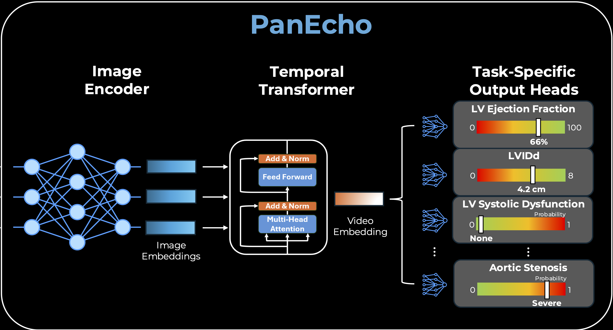

## Introduction

PanEcho an end-to-end, view-agnostic deep learning model capable of simultaneously performing the full range of key echocardiographic reporting tasks.




We designed a multitask, video-based deep learning model with a 2D image encoder, temporal transformer, and output heads dedicated to individual tasks (Figure 1B). In its design, the AI system mimics a human reader, integrating all available echocardiographic views and assessing all 39 echocardiographic reporting tasks described above. Each video frame is first processed by the 2D image encoder, a convolutional neural network that produces a learned embedding of each frame. These framewise embeddings are then interpreted as an ordered sequence and modeled using self attention30 to learn time-varying associations over the frames. Finally, a video-level embedding is formed and used as input to the task-specific output heads. Rather than develop separate view- and task-specific models, this design efficiently shares computation across views with a unified view-agnostic encoder and parallelizes task-specific modeling with lightweight output heads specialized for each task. The model was trained end to end to minimize the mean of all task-specific losses.


src/models.py

`PositionalEncoding` implements the sinusoidal positional encoding. It is a way to represent position in a sequence as a vector of sine and cosine values at different frequencies. It was introduced in the original Transformer paper ("Attention Is All You Need", 2017).

`ImageEncoder` consists of an if-else ladder of different CNN backbones (ResNet, DenseNet, EfficientNet) to extract features from the input image. Builds an image model, loads pre-trained weights, and removes the final classification layer and replaces it with the Identity function to output the feature vector.


### `FrameTransformer` class

```{python}
class FrameTransformer(torch.nn.Module):
    """2+1D architecture with 2D image encoder and 1D temporal Transformer for echocardiogrpahy video modeling."""
    def __init__(self, arch, n_heads, n_layers, transformer_dropout, pooling, clip_len=16):
        super(FrameTransformer, self).__init__()
        self.pooling = pooling
        self.encoder = ImageEncoder(arch)

        transformer_encoder = torch.nn.TransformerEncoderLayer(d_model=self.encoder.n_features, nhead=n_heads, dim_feedforward=self.encoder.n_features, dropout=transformer_dropout, activation='relu', batch_first=True)
        self.transformer = torch.nn.TransformerEncoder(transformer_encoder, num_layers=n_layers)
 
        self.classifier = torch.nn.Identity()
    
        self.time_encoder = PositionalEncoding(d_model=self.encoder.n_features, dropout=0, max_len=clip_len)
```


```{python}
transformer_encoder = torch.nn.TransformerEncoderLayer(d_model=self.encoder.n_features, nhead=n_heads, dim_feedforward=self.encoder.n_features, dropout=transformer_dropout, activation='relu', batch_first=True)
```

This builds one Transformer encoder layer (`transformer_encoder`) with the following parameters:
- `d_model`: The dimension of the input and output feature vectors, which is set to the number of features output by the image encoder (`self.encoder.n_features`).
- `nhead`: The number of attention heads in the multi-head attention mechanism. `d_model` is split across heads. 
- `dim_feedforward`: The dimension of the feedforward network within the Transformer encoder layer, which is also set to `self.encoder.n_features`.
- `dropout`: The dropout rate applied to the output of the feedforward network and the attention mechanism, specified by the `transformer_dropout` parameter.
- `activation`: The activation function used in the feedforward network.
- `batch_first` : Indicates that the input and output tensors are expected to have the batch size as the first dimension.


```{python}
# Initialize the Transformer encoder
self.transformer = nn.TransformerEncoder(encoder_layer=self.transformer_encoder, num_layers=num_layers)
```

Then, `self.transformer` is created by stacking `num_layers` of these `transformer_encoder` layers to form a full Transformer encoder. This allows the model to learn complex temporal relationships in the echocardiography video data.

```{python}
self.classifier = torch.nn.Identity()
```

Then, the model's output is passed through a classifier to produce the final prediction. In this case, the classifier is set to `torch.nn.Identity()`, which means it will simply return the output of the Transformer without applying any additional transformations. 

```{python}
self.time_encoder = PositionalEncoding(d_model=self.encoder.n_features, dropout=0, max_len=clip_len)
```

Finally, `self.time_encoder` is initialized as an instance of the `PositionalEncoding` class, which will be used to add positional information to the feature vectors before they are passed through the Transformer. The `max_len` parameter is set to `clip_len`, which indicates the maximum length of the input sequence (number of frames in the video clip) that the model can handle. This allows the model to learn temporal relationships between frames in the echocardiography video.


#### forward method

The `forward` method takes an input tensor `x` of shape `(batch_size, channels, clip_len, height, width)` and processes it as follows:

The input tensor is first reshaped to `(batch_size * clip_len, channels, height, width)` to ensure the correct dimensions for processing and then passed through the image encoder to extract features from each frame. The output of the image encoder is shaped 
`(batch_size * clip_len, 1024)`. 

After reshaping to `(batch_size, clip_len, 1024)`, the positional encoding is added to the feature vectors to incorporate temporal information. The resulting tensor is then passed through the Transformer encoder to model the temporal relationships between frames.  The output of the Transformer is shaped `(batch_size, clip_len, n_features)` - e.g. `(2, 16, 1024)`.

Temporal pooling step is applied by computing the mean along axis 1 (the frame axis), which averages across all 16 frames and removes that dimension. This results in a tensor of shape `(batch_size, n_features)`, - e.g. `(2, 1024)` giving us a single feature vector for each video clip. Finally, the output of the Transformer is passed through the classifier (which is an identity function in this case) to produce the final output.


### `MultiTaskModel` class

Top-level PanEcho model. Take the shared video encoder and attach one prediction head per clinical task, so a single forward pass produces dozens of outputs.

```{python}
class MultiTaskModel(torch.nn.Module):
    """Multi-task model with shared video encoder and separate prediction heads for each clinical task."""
    def __init__(self, encoder, encoder_dim, tasks, fc_dropout=0, activations=True):
        super().__init__()
        self.encoder = encoder
        self.tasks = tasks
        self.activations = activations

        for task in self.tasks:
            if task.task_type == 'multi-class_classification':
                self.add_module(task.task_name+'_head', torch.nn.Sequential(torch.nn.Dropout(p=fc_dropout), torch.nn.Linear(encoder_dim, task.class_names.size)))
            else:  # binary classification or regression, both have 1 output
                self.add_module(task.task_name+'_head', torch.nn.Sequential(torch.nn.Dropout(p=fc_dropout), torch.nn.Linear(encoder_dim, 1)))
            
                # Initialize bias term to training set mean value (to account for different scales/units)
                self.get_submodule(task.task_name+'_head')[-1].bias.data[0] = task.mean
```

Multi-class classification: A head that maps `encoder_dim`-wide feature vector to one output per class (`task.class_names.size` outputs)

Binary classification or regression: A head that maps `encoder_dim`-wide feature vector to a single output (1 output). Then, sets the bias of the head's final `Linear` layer to that task's training-set mean value. 


#### forward method

```{python}
def forward(self, x):
    x = self.encoder(x)

    out_dict = {}
    for task in self.tasks:
        out = self.get_submodule(task.task_name+'_head')(x)

        if self.activations:
            if task.task_type == 'binary_classification':
                # Ensure that output corresponds to "positive" class for all binary classification tasks
                if task.task_name in ['MVStenosis', 'AVStructure', 'RASize', 'RVSystolicFunction', 'LVWallThickness-increased-modsev', 'LVWallThickness-increased-any', 'pericardial-effusion']:
                    out_dict[task.task_name] = 1-torch.sigmoid(out)
                else:
                    out_dict[task.task_name] = torch.sigmoid(out)
            elif task.task_type == 'multi-class_classification':
                out_dict[task.task_name] = torch.softmax(out, dim=1)
            else:
                out_dict[task.task_name] = out
        else:
            out_dict[task.task_name] = out

    return out_dict
```

In the forward method, we run the input through the shared video encoder to get a feature vector `(batch_size, encoder_dim)` and then pass that feature vector through each task's prediction head to get the output for that task. The outputs for all tasks are collected in a dictionary and returned.

### hubconf.py

Imports the classes built in `models.py` and hands you a ready-to-use model. 

```{python}
arch = 'convnext_tiny'
n_layers = 4
n_heads = 8
pooling = 'mean'
transformer_dropout = 0.
```

First, initialize the PanEcho architecture specifications, exactly the constructor arguments that `FrameTransformer` expects. So the architecture of the image encoder is set to `convnext_tiny`, the number of Transformer layers is set to 4, the number of attention heads is set to 8, the pooling method is set to 'mean', and the dropout rate for the Transformer is set to 0. 

```{python}
# Load tasks
task_dict = pd.read_pickle(
    'https://github.com/CarDS-Yale/PanEcho/blob/main/content/tasks.pkl?raw=true'
)
all_tasks = list(task_dict.keys())
task_list = [
    Task(t, task_dict[t]['task_type'], task_dict[t]['class_names'], task_dict[t]['mean'])
    for t in all_tasks
]
```

Load a Python pickle file containing the definitions of all the clinical tasks that PanEcho is designed to predict. Each task is represented as an instance of the `Task` class, which includes the task name, type (e.g., binary classification, multi-class classification, regression), class names (if applicable), and mean value (for regression tasks).


```{python}
encoder = FrameTransformer(arch, n_heads, n_layers, transformer_dropout, pooling, clip_len)
encoder_dim = encoder.encoder.n_features
model = MultiTaskModel(encoder, encoder_dim, task_list, 0.25, activations)
```

Initialize the encoder using the `FrameTransformer` class with the specified architecture parameters. Then, create an instance of the `MultiTaskModel` class, passing in the encoder, its output feature dimension (`encoder_dim`), the list of tasks, a dropout rate of 0.25 for the fully connected layers in the prediction heads, and whether to apply activation functions to the outputs.

```{python}
# Load pretrained weights
if pretrained:
    weights_url = 'https://github.com/CarDS-Yale/PanEcho/releases/download/v1.0/panecho.pt'
    weights = torch.hub.load_state_dict_from_url(
        weights_url, map_location='cpu', progress=False
    )['weights']
    # Remove fixed positional encoding to allow variable clip_len
    del weights['encoder.time_encoder.pe']
    msg = model.load_state_dict(weights, strict=False)
```

Load pretrained weights from `torch.hub.load_state_dict_from_url(weights_url, map_location='cpu', progress=False)` which downloads the weights from the specified URL. The weights are stored in a dictionary, and we extract the 'weights' key to get the actual state dictionary for the model. Then, we remove the fixed positional encoding weights (`encoder.time_encoder.pe`) from the state dictionary to allow for variable clip lengths during inference. Finally, we load the remaining weights into the model using `model.load_state_dict(weights, strict=False)`, which allows for missing keys (like the removed positional encoding) without raising an error.


## Demo

TODO: Walk through one sample data entry, show how it flows through the model, and explain the dimensions at each step.

```{python}

```