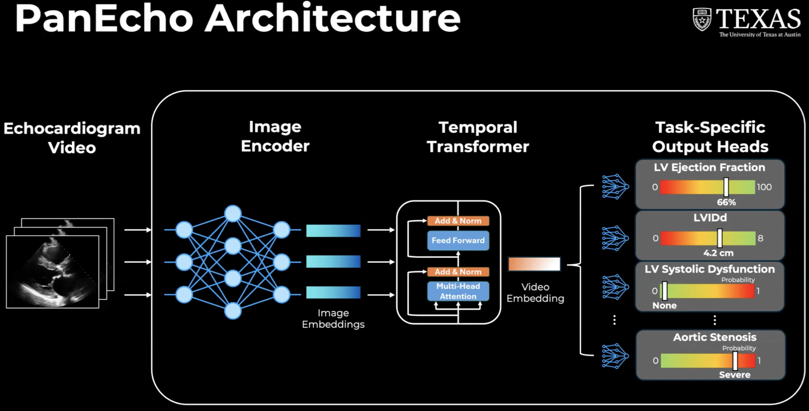

## Introduction

This post is a code-focused deep dive into a echocardiographic deep learning model called [PanEcho](https://www.medrxiv.org/content/10.1101/2024.11.16.24317431v2). PanEcho is a multivew, multitask, and video-based deep learning model capable of performing 39 diverse interpretation tasks. PanEcho consists of a 2D image encoder, temporal transformer, and output heads dedicated to the 39 individual tasks.




PanEcho processes an echocardiogram video — a sequence of frames — and turns it into predictions for 39 clinical tasks. The model does this in four stages:

1. **Per-frame feature extraction:** Each video frame is passed independently through the 2D image encoder: an ImageNet-pretrained ConvNeXt-Tiny CNN. The CNN compresses each frame into a single 768-dimensional feature vector summarizing the anatomy/spatial content visible in that frame. Temporal dynamics across frames are then modeled separately by a 1D temporal Transformer over the sequence of frame embeddings.

2. **Adding temporal order:** A CNN treats each frame in isolation, so the model has no inherent sense of which frame came first. To restore this, the frame's position in the sequence is encoded with a sinusoidal positional encoding and added elementwise to its feature vector. 

3. **Modeling relationships across frames:** The position-aware feature vectors are fed into a Transformer encoder of four layers, each with eight self-attention heads. Self-attention lets every frame attend to every other frame, so the Transformer can model temporal dynamics across the whole clip — for example, how the heart wall moves between systole and diastole — and produces a refined, context-aware feature vector for each frame.

4. **Pooling and prediction:** The refined frame-wise vectors are aggregated into a single video-level representation by mean pooling (averaging across the frame axis). This one vector is fed to each of the task-specific output heads. Every head consists of a Dropout layer followed by a fully-connected layer that produces that task's prediction.

In the rest of this post, we will go through the `FrameTransformer` class, the `MultiTaskModel` class, and the PanEcho model listed on the [PyTorch Hub](https://pytorch.org/hub/). The `FrameTransformer` class specifies the architecture involving the 2D image encoder and 1D temporal Transformer. The `MultiTaskModel` class defines the multitask learning component, combining the frame-level features with task-specific heads to produce the final predictions.


## `FrameTransformer` Class

The `FrameTransformer` class implements the 2+1D architecture with the 2D image encoder and 1D temporal Transformer for echocardiography video modeling. The `__init__` method initializes the architecture with the specified parameters.

```{python}
class FrameTransformer(torch.nn.Module):
    """2+1D architecture with 2D image encoder and 1D temporal
    Transformer for echocardiography video modeling."""
    def __init__(self, arch, n_heads, n_layers, transformer_dropout,
                 pooling, clip_len=16):
        super(FrameTransformer, self).__init__()
        self.pooling = pooling
        self.encoder = ImageEncoder(arch)

        transformer_encoder = torch.nn.TransformerEncoderLayer(
            d_model=self.encoder.n_features,
            nhead=n_heads,
            dim_feedforward=self.encoder.n_features,
            dropout=transformer_dropout,
            activation='relu',
            batch_first=True,
        )
        self.transformer = torch.nn.TransformerEncoder(
            transformer_encoder, num_layers=n_layers
        )

        self.classifier = torch.nn.Identity()

        self.time_encoder = PositionalEncoding(
            d_model=self.encoder.n_features, dropout=0, max_len=clip_len
        )
```

### `__init__()` method

The `FrameTransformer` class uses the `ImageEncoder` class to define a 2D image encoder. The `ImageEncoder` class dispatches depending on the `arch` argument, which defines the intended architecture, such as ResNet, ConvNeXt, or Swin. For the PanEcho model, we use the ConvNeXt Tiny model architecture. Then, it records the size of the original classification layer's input and replaces the classification layer with `torch.nn.Identity()`. 

Also, the `FrameTransformer` class builds one Transformer encoder layer (`transformer_encoder`) with the following parameters:

- `d_model`: The dimension of the input and output feature vectors, which is set to the number of features output by the image encoder (`self.encoder.n_features`).
- `nhead`: The number of attention heads in the multi-head attention mechanism. `d_model` is split across heads. 
- `dim_feedforward`: The dimension of the feedforward network within the Transformer encoder layer, which is also set to `self.encoder.n_features`.
- `dropout`: The dropout rate applied to the output of the feedforward network and the attention mechanism, specified by the `transformer_dropout` parameter.
- `activation`: The activation function used in the feedforward network.
- `batch_first` : Indicates that the input and output tensors are expected to have the batch size as the first dimension.

Then, we form a full Transformer encoder by stacking `num_layers` of these `transformer_encoder` layers. This allows the model to learn complex temporal relationships in the echocardiography video data.

```{python}
self.classifier = torch.nn.Identity()
```

The model's classifier is set to `torch.nn.Identity()`, which means it will simply return the output of the Transformer without applying any additional transformations. 

`self.time_encoder` is initialized as an instance of the `PositionalEncoding` class, which will be used to add positional information to the feature vectors before they are passed through the Transformer. The `max_len` parameter is set to `clip_len`, which indicates the maximum length of the input sequence (number of frames in the video clip) that the model can handle. This allows the model to learn temporal relationships between frames in the echocardiography video.


### `forward()` method

The `forward()` method takes an input tensor `x` of shape `(batch_size, channels, clip_len, height, width)` and processes it as follows:

1. The input tensor is reshaped to `(batch_size * clip_len, channels, height, width)` to ensure the correct dimensions for processing and then passed through the image encoder to extract features from each frame. The output shape of the image encoder is `(batch_size * clip_len, n_features)`. 

2. After reshaping to `(batch_size, clip_len, n_features)`, the positional encoding is added to the feature vectors to incorporate temporal information. The resulting tensor is then passed through the Transformer encoder to model the temporal relationships between frames.  The output of the Transformer is shaped `(batch_size, clip_len, n_features)` - e.g. `(2, 16, 1024)`.

3. Temporal pooling step is applied by computing the mean along axis 1 (the frame axis), which averages across all 16 frames and removes that dimension. This results in a tensor of shape `(batch_size, n_features)`, - e.g. `(2, 1024)` giving us a single feature vector for each video clip. 

4. Finally, the output of the Transformer is passed through the classifier (which is an identity function in this case) to produce the final output.


## `MultiTaskModel` class

The `MultiTaskModel` class is the top-level PanEcho model. It takes the shared video encoder (the `FrameTransformer` class) and attaches one prediction head per clinical task. As a result, a single forward pass produces multiple outputs. The `__init__` method initializes the `MultiTaskModel` class with the specified parameters.

```{python}
class MultiTaskModel(torch.nn.Module):
    """Multi-task model with shared video encoder and separate
    prediction heads for each clinical task."""
    def __init__(self, encoder, encoder_dim, tasks, fc_dropout=0,
                 activations=True):
        super().__init__()
        self.encoder = encoder
        self.tasks = tasks
        self.activations = activations

        for task in self.tasks:
            if task.task_type == 'multi-class_classification':
                self.add_module(
                    task.task_name + '_head',
                    torch.nn.Sequential(
                        torch.nn.Dropout(p=fc_dropout),
                        torch.nn.Linear(encoder_dim, task.class_names.size),
                    ),
                )
            else:  # binary classification or regression, both have 1 output
                self.add_module(
                    task.task_name + '_head',
                    torch.nn.Sequential(
                        torch.nn.Dropout(p=fc_dropout),
                        torch.nn.Linear(encoder_dim, 1),
                    ),
                )

                # Initialize bias term to training set mean value
                # (to account for different scales/units)
                head = self.get_submodule(task.task_name + '_head')
                head[-1].bias.data[0] = task.mean
```

### `__init__()` method

The `MultiTaskModel` class creates a `head` for each task, consisting of a `Dropout` and a `Linear` layer. The output width depends on whether the task type is binary classification or regression or multi-class classification:

- Binary classification or regression: A head that maps `encoder_dim`-wide feature vector to a single output (1 output). Then, it sets the bias of the head's final `Linear` layer to that task's training-set mean value to account for different scales.
- Multi-class classification: A head that maps `encoder_dim`-wide feature vector to one output per class (`task.class_names.size` outputs)


### forward() method

```{python}
def forward(self, x):
    x = self.encoder(x)

    out_dict = {}
    for task in self.tasks:
        out = self.get_submodule(task.task_name+'_head')(x)

        if self.activations:
            if task.task_type == 'binary_classification':
                # Ensure that output corresponds to "positive" class
                # for all binary classification tasks
                flipped_tasks = [
                    'MVStenosis', 'AVStructure', 'RASize',
                    'RVSystolicFunction', 'LVWallThickness-increased-modsev',
                    'LVWallThickness-increased-any', 'pericardial-effusion',
                ]
                if task.task_name in flipped_tasks:
                    out_dict[task.task_name] = 1-torch.sigmoid(out)
                else:
                    out_dict[task.task_name] = torch.sigmoid(out)
            elif task.task_type == 'multi-class_classification':
                out_dict[task.task_name] = torch.softmax(out, dim=1)
            else:
                out_dict[task.task_name] = out
        else:
            out_dict[task.task_name] = out

    return out_dict
```

In the forward method, we run the input through the shared video encoder (`FrameTransformer` class) to get a feature vector `(batch_size, encoder_dim)` and then pass that feature vector through each task's prediction head, then run an activation function to get the output for that task. The outputs for all tasks are collected and returned.

### Torch Hub

The PanEcho repo contains a `hubconf.py` file that imports the classes built in `models.py` and provides a ready-to-use model with the `PanEcho()` function.

```{python}
arch = 'convnext_tiny'
n_layers = 4
n_heads = 8
pooling = 'mean'
transformer_dropout = 0.
```

First, it initializes the PanEcho architecture with the constructor arguments that `FrameTransformer` expects. The architecture of the image encoder is set to `convnext_tiny`, the number of Transformer layers is set to `4`, the number of attention heads is set to `8`, the pooling method is set to `mean`, and the dropout rate for the Transformer is set to `0` (no dropout). 

```{python}
# Load tasks
task_dict = pd.read_pickle(
    'https://github.com/CarDS-Yale/PanEcho/blob/main/content/tasks.pkl?raw=true'
)
all_tasks = list(task_dict.keys())
task_list = [
    Task(
        t,
        task_dict[t]['task_type'],
        task_dict[t]['class_names'],
        task_dict[t]['mean'],
    )
    for t in all_tasks
]
```

Then, it loads a file containing the definitions of all the clinical tasks that PanEcho is designed to predict. Each task is represented as an instance of the `Task` class, which includes the task name, type (e.g., binary classification, multi-class classification, regression), class names (if applicable), and mean value (for regression tasks).


```{python}
encoder = FrameTransformer(
    arch, n_heads, n_layers, transformer_dropout, pooling, clip_len
)
encoder_dim = encoder.encoder.n_features
model = MultiTaskModel(
    encoder, encoder_dim, task_list, 0.25, activations
)
```

Then, it initializes the shared video encoder (`FrameTransformer` class) with the specified architecture parameters and creates an instance of the `MultiTaskModel` class, passing in the shared video encoder, its output feature dimension (`encoder_dim`), the list of tasks, a dropout rate of 0.25 for the fully connected layers in the prediction heads, and whether to apply activation functions to the outputs.

```{python}
# Load pretrained weights
if pretrained:
    weights_url = 'https://github.com/CarDS-Yale/PanEcho/releases/download/v1.0/panecho.pt'
    weights = torch.hub.load_state_dict_from_url(
        weights_url, map_location='cpu', progress=False
    )['weights']
    # Remove fixed positional encoding to allow variable clip_len
    del weights['encoder.time_encoder.pe']
    msg = model.load_state_dict(weights, strict=False)
```

Finally, it loads the pretrained weights from the PanEcho GitHub repo. The weights are stored in a dictionary, and we extract the 'weights' key to get the actual state dictionary for the model. Then, we remove the fixed positional encoding weights (`encoder.time_encoder.pe`) from the state dictionary to allow for variable clip lengths during inference. Finally, we load the remaining weights into the model using `model.load_state_dict(weights, strict=False)`, which allows for missing keys (like the removed positional encoding) without raising an error.


## Demo

TODO: Walk through one sample data entry, show how it flows through the model, and explain the dimensions at each step.

```{python}

```