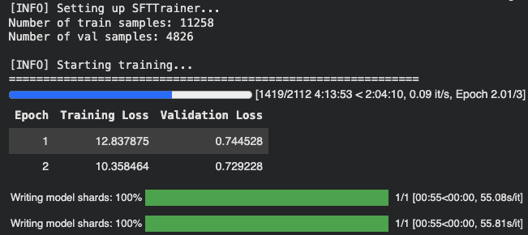
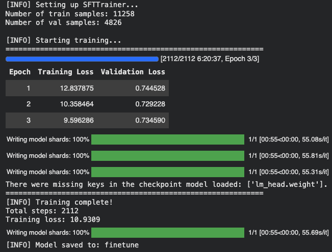

## Introduction

In this post, I will walk through code for finetuning a language model using the [TRL (Transformer Reinforcement Learning)](https://huggingface.co/docs/trl/index) library from Hugging Face. TRL is a general-purpose library for training transformer-based models with methods like Supervised Fine-Tuning (SFT), Proximal Policy Optimization (PPO), and more. It provides a high-level API for training language models and is integrated with the transformers Hugging Face library.

This tutorial is based on the [Sunny MedGemma Fine-Tuning Notebook](https://github.com/mrdbourke/sunny/blob/main/sunny_MedGemma_fine_tuning.ipynb), which demonstrates how to finetune MedGemma-1.5 for strutured skin and sunscreen photo extraction. I will adapt the code to finetune a language model on the [ShenLab/MentalChat16K dataset](https://huggingface.co/datasets/ShenLab/MentalChat16K) for generating responses in a mental health context.

The code for this tutorial is available in this [Google Colab notebook](https://colab.research.google.com/drive/14eeL-_ukmb8fbRijAgAwhOSiaDzF2WBY?usp=sharing) and the final finetuned model is available on the Hugging Face Hub at [howardbaik/gemma-4-E4B-it-mentalchat16k](https://huggingface.co/howardbaik/gemma-4-E4B-it-mentalchat16k).

## Setup

First, we install the necessary libraries. We will need `transformers`, `torch`, `accelerate`, and `trl` for this tutorial:

```{python}
!pip install -U transformers torch accelerate trl
```

The dataset is the [MentalChat16K dataset](https://huggingface.co/datasets/ShenLab/MentalChat16K), which contains approximately 16,000 conversations between a mental health professional and a patient. We will use this dataset to finetune a language model for generating responses in a mental health context. 

We can load the dataset using the `datasets` library from Hugging Face:
```{python}
from datasets import load_dataset

dataset = load_dataset("ShenLab/MentalChat16K")
dataset
```

where `dataset` is a dictionary containing the train dataset, which we can access using `dataset["train"]`. 

Each example in the dataset contains a conversation between a mental health professional and a patient, with the following fields:

```
Dataset({
    features: ['instruction', 'input', 'output'],
    num_rows: 16084
})
```

The `instruction` field contains the prompt or instruction for the model ("You are a helpful mental health counselling assistant"), the `input` field contains the patient transcript, and the `output` field contains the response from the mental health professional.

An example of the `input` field:


> Another aspect of my anxiety is related to social situations. I find myself constantly worrying about what others think of me and fearing judgment or rejection. For example, attending parties or meeting new people can be incredibly stressful for me because I'm always concerned about saying or doing something embarrassing.


An example of the `output` field:

> It can be challenging to navigate social situations when anxiety is present, especially when worrying about others' opinions and the fear of judgment or rejection. Here are some suggestions that may help you manage these anxieties:\n\n1. Challenge negative thoughts: When you catch yourself worrying about what others think of you, try to challenge those thoughts by asking yourself if there's any evidence supporting them. Often, our anxious thoughts are not based on reality but rather on our own insecurities.

## Data Formatting

We format the data in conversational message format that the model can understand, and split the train dataset into training and validation sets:

```{python}
full_train_data = [format_data(sample) for sample in dataset["train"]]

train_dataset, val_dataset = train_test_split(
    full_train_data, test_size=0.3, random_state=42
)
```

The conversational message format that the `format_data()` function formats the data into is as follows:
```
"messages": [
            # [USER] Prompt
            {
                "role": "user",
                "content": [
                    {
                        "type": "text",
                        "text": sample["input"],
                    }
                ],
            },
            # [ASSISTANT] Desired model output
            {
                "role": "assistant",
                "content": [
                    {
                        "type": "text",
                        "text": output_text,
                    }
                ],
            }
        ]
```


## Test Base Model on Example

Before finetuning, we can test the base model on an example to see what the base model output looks like. We will use the `transformers` library to load a pre-trained language model and tokenizer, and then generate a response for a sample input from the dataset:

```{python}
from transformers import AutoProcessor, AutoModelForCausalLM

MODEL_ID = "google/gemma-4-E4B-it"

# Load model
processor = AutoProcessor.from_pretrained(MODEL_ID)
model = AutoModelForCausalLM.from_pretrained(
    MODEL_ID,
    dtype="auto",
    device_map="auto"
)
```

Our base model is [`google/gemma-4-E4B-it`](https://huggingface.co/google/gemma-4-E4B-it), which is a 4 billion effective parameter language model from Google. The "E" in "E4B" stands for "effective". 

We load a processor with `AutoProcessor` and the `from_pretrained()` method. Processors preprocess multimodal inputs into the expected Transformers format. Also, we load a pre-trained language model with `AutoModelForCausalLM` and the `from_pretrained()` method. `dtype="auto"` allows the model to automatically use the most efficient data type (e.g., `bfloat16` or `float16`) based on the hardware capabilities, and `device_map="auto"` automatically maps the model layers to available devices (e.g., GPU) for optimal performance.

Let's now generate a response for a sample input inserted into the base model. 

First, we process the input data into the format expected by the model using the processor:

```{python}
example_input_messages = train_dataset[0]["messages"][:1]

# Process input
example_inputs = processor.apply_chat_template(
    example_input_messages,
    add_generation_prompt=True,
    tokenize=True,
    return_dict=True,
    return_tensors="pt",
).to(model.device)
```

The `apply_chat_template()` method of the processor takes the input messages and formats them according to the chat template expected by the model. We set `add_generation_prompt=True` to add a generation prompt to the input, which helps guide the model in generating a response. We also set `tokenize=True` to tokenize the input text, and `return_dict=True` and `return_tensors="pt"` to return the processed input as a PyTorch tensor. 

The processed input looks like this:
```
{'input_ids': tensor([[     2,    105,   2364,    107,  94801,    815,   1010,   3788,    872,
            657,    981,   2779,    531,    506,   1494,  16332,    532,  11119,
          58658, 236761,   1030, 236789, 236751,  14260, 161592,  22998, 236764,
         167902, 236764,    532,  14644,  77320, 236761,    564,   1202,   1601,
           8159,   5225,   4861,    531,   6060,    981, 236772,  10619,   5013,
           2180,  94437,   1041,   9069,   1388, 236772,  16898, 236761,    106,
            107,    105,   4368,    107]], device='cuda:0'), 'attention_mask': tensor([[1, 1, 1, 1, 1, 1, 1, 1, 1, 1, 1, 1, 1, 1, 1, 1, 1, 1, 1, 1, 1, 1, 1, 1,
         1, 1, 1, 1, 1, 1, 1, 1, 1, 1, 1, 1, 1, 1, 1, 1, 1, 1, 1, 1, 1, 1, 1, 1,
         1, 1, 1, 1, 1, 1, 1, 1, 1, 1]], device='cuda:0'), 'mm_token_type_ids': tensor([[0, 0, 0, 0, 0, 0, 0, 0, 0, 0, 0, 0, 0, 0, 0, 0, 0, 0, 0, 0, 0, 0, 0, 0,
         0, 0, 0, 0, 0, 0, 0, 0, 0, 0, 0, 0, 0, 0, 0, 0, 0, 0, 0, 0, 0, 0, 0, 0,
         0, 0, 0, 0, 0, 0, 0, 0, 0, 0]], device='cuda:0')}
```

- The `input_ids` are the tokenized input text.
- The `attention_mask` indicates which tokens should be attended to (1 for real tokens, 0 for padding).
- The `mm_token_type_ids` are used for multimodal inputs (not relevant for our text-only input).


We can then generate a response from the base model using the `generate()` method:
```{python}
import torch
import json

with torch.no_grad():
    output_ids = model.generate(
        **example_inputs,
        max_new_tokens=512,
        do_sample=False,
    )
    input_len = example_inputs['input_ids'].shape[-1] # Ensure input_len is correctly retrieved
    generated_ids = output_ids[0][input_len:]

base_model_output = processor.decode(generated_ids, skip_special_tokens=True)
desired_output = train_dataset[0]["messages"][-1]["content"][0]["text"]

print(f"\n[INFO] Base model output:\n{base_model_output}")
print(f"\n[INFO] Desired output:\n{desired_output}")
```


```
[INFO] Base model output:
It sounds like you are under an immense amount of pressure right now, and it's completely understandable that this is affecting your sleep, mood, and focus. Work stress, especially when coupled with high demands and tight deadlines, is a serious issue that needs proactive management.

The key here is finding a balance: **managing the external demands** while **strengthening your internal resilience.**

Here is a comprehensive, multi-layered approach broken down into immediate, short-term, and long-term strategies.

---

## 🧠 Phase 1: Immediate Relief (When You Feel Overwhelmed *Right Now*)

These techniques are for when you are in the middle of a stressful moment (e.g., before a big meeting, after a frustrating email).

1. **The 4-7-8 Breathing Technique:** This is a powerful, quick nervous system reset.
    * Exhale completely through your mouth, making a whoosh sound.
    * Close your mouth and **inhale quietly through your nose for a count of 4.**
    * **Hold your breath for a count of 7.**
    * **Exhale completely through your mouth with a whoosh sound for a count of 8.**
    * Repeat this cycle 3-4 times.
2. **The 5-4-3-2-1 Grounding Technique:** This pulls your mind out of anxious future-planning and anchors it in the present moment.
    * **5:** Name five things you can **see**.
    * **4:** Name four things you can **feel** (the chair beneath you, your shirt fabric).
    * **3:** Name three things you can **hear**.
    * **2:** Name two things you can **smell**.
    * **1:** Name one thing you can **taste**.
3. **Micro-Breaks:** Do not power through exhaustion. Set a timer for every 45-60 minutes. When it goes off, stand up, walk to a window, stretch, or get a glass of water. Even 2 minutes of movement helps reset cognitive fatigue.

---


[INFO] Desired output:
It can be incredibly challenging when work-related stress starts to impact our mental well-being. The demands and deadlines can feel overwhelming, leading to sleepless nights, irritability, and difficulty concentrating. It's important to prioritize your mental health and find effective ways to manage this stress. Here are some suggestions that may help:

1. Take breaks: Allow yourself regular breaks throughout the day to recharge and reset. Step away from your workspace, take a short walk, or engage in a quick relaxation exercise. These moments of rest can help reduce stress levels and improve focus.

2. Prioritize self-care: Make sure you're taking care of yourself outside of work as well. Engage in activities that bring you joy and help you relax. This could include hobbies, exercise, spending time with loved ones, or practicing mindfulness techniques such as deep breathing or meditation.

3. Set boundaries: Establish clear boundaries between work and personal life. Avoid bringing work home whenever possible and try to disconnect from work-related tasks during your non-working hours. Creating a healthy work-life balance can contribute to reducing stress and improving overall well-being.

4. Seek support: Reach out to trusted friends, family members, or colleagues who can provide emotional support. Talking about your experiences and feelings with someone who understands can be cathartic and help alleviate stress. Additionally, consider joining support groups or seeking professional counseling if needed.

5. Time management: Develop effective time management strategies to help you stay organized and meet deadlines without feeling overwhelmed. Break down larger tasks into smaller, more manageable steps, and prioritize them based on importance and urgency. This can help create a sense of control and reduce stress levels.

6. Practice stress-reducing techniques: Explore different stress-management techniques that work for you. This could include deep breathing exercises, progressive muscle relaxation, journaling, listening to calming music, or engaging in creative outlets like painting or writing. Experiment with various methods until you find what resonates with you.

Remember, it's essential to be patient and kind to yourself during this process. Finding effective ways to handle work-related stress takes time and experimentation. If the stress continues to impact your mental well-being significantly, consider seeking professional help from a mental health expert who can provide personalized guidance tailored to your specific needs.
```

Compared to the desired output (shown below `[INFO] Desired output:`), the base model output (shown below `[INFO] Base model output:`) is quite verbose and comprehensive.

Let's finetune the base model on the [ShenLab/MentalChat16K dataset](https://huggingface.co/datasets/ShenLab/MentalChat16K) to see if we can get it to generate responses that are more similar to the desired output.

## Setup SFT Trainer for Supervised Fine-Tuning

We then set up the `SFTTrainer` from the TRL library to perform supervised fine-tuning on our dataset. We define the training configuration using `SFTConfig`, which includes parameters such as the number of epochs, batch size, learning rate, and more:

```{python}
from trl import SFTConfig, SFTTrainer

OUTPUT_DIR = "finetune"

training_args = SFTConfig(
    output_dir=OUTPUT_DIR,

    # Training duration
    num_train_epochs=3, # Because of its vast pretraining, we don't need too many epochs to our model to perform how we'd like

    # Batch size & accumulation
    per_device_train_batch_size=1, # Adjusted from 2 to 1 to reduce memory usage
    per_device_eval_batch_size=2,
    gradient_accumulation_steps=16, # Adjusted from 8 to 16 to maintain an effective batch size of 16 (1 * 16)

    # Memory optimization
    gradient_checkpointing=True,
    gradient_checkpointing_kwargs={"use_reentrant": False},

    # Optimizer
    optim="adamw_torch_fused",
    learning_rate=2e-5, # Lower LR for larger model
    max_grad_norm=1.0,
    #warmup_ratio=0.03, # Note: warmup_ratio is deprecated and will be removed, use `warmup_steps` instead
    warmup_steps=5, # total_steps = (num_samples // (batch_size * gradient_accumulation_steps)) * num_epochs, we'll use 3% of steps for warmup, 0.03 * 183 (num total steps) = 5
    lr_scheduler_type="cosine",

    # Precision
    bf16=True,

    # Logging & saving
    logging_strategy="epoch",
    eval_strategy="epoch",
    save_strategy="epoch",
    save_total_limit=2,
    load_best_model_at_end=True,

    # Hub
    push_to_hub=False, # We could push our model straight to the hub after training if we like
    report_to="none", # Optional: track experiments with trackio or Weights & Biases

    # Dataset handling (important for custom collate)
    dataset_text_field="",
    dataset_kwargs={"skip_prepare_dataset": True},
    remove_unused_columns=False,
)
```

Think of `training_args` as the knobs we turn for our training run. It specifies how long we want to train (number of epochs), how big our batches should be, how to optimize the model (optimizer and learning rate), how to handle memory (gradient checkpointing), how often to log and save the model, and more.

## Train the model using the `SFTTrainer`

We then proceed with fine-tuning the model using the `SFTTrainer`. We pass in the model, training arguments, training and validation datasets, processor for data preprocessing, and a custom data collate function for batching:

```{python}
trainer = SFTTrainer(
    model=model,
    args=training_args,
    train_dataset=train_dataset,
    eval_dataset=val_dataset,
    processing_class=processor,
    data_collator=collate_fn
)

print(f"\n[INFO] Starting training...")
print("=" * 60)
train_result = trainer.train()
print("=" * 60)
print(f"[INFO] Training complete!")
print(f"Total steps: {train_result.global_step}")
print(f"Training loss: {train_result.training_loss:.4f}")

# Save the final model
trainer.save_model()
print(f"[INFO] Model saved to: {OUTPUT_DIR}")
```

After 6 hrs (!!!) of training on an A100 GPU High RAM instance on Google Colab, the training completed successfully. Here are some visualizations of the training process:

After 2 epochs (training in progress):


After 3 epochs (training complete):



We notice that the training loss keeps decreasing as the number of epochs increases, which is a good sign that the model is learning from the data. The evaluation loss also decreases, indicating that the model is improving its performance on the validation set.


## Conclusion

To finish off, we can test the finetuned model on the same example input to see how the output has changed after fine-tuning:

```{python}
# Process input for the fine-tuned model
finetuned_example_inputs = loaded_processor.apply_chat_template(
    example_input_messages,
    add_generation_prompt=True,
    tokenize=True,
    return_dict=True,
    return_tensors="pt",
).to(loaded_model.device)

# Generate output with the fine-tuned model
with torch.no_grad():
    finetuned_output_ids = loaded_model.generate(
        **finetuned_example_inputs,
        max_new_tokens=512,
        do_sample=False,
    )
    finetuned_input_len = finetuned_example_inputs['input_ids'].shape[-1]
    finetuned_generated_ids = finetuned_output_ids[0][finetuned_input_len:]

finetuned_model_output = loaded_processor.decode(finetuned_generated_ids, skip_special_tokens=True)

print(f"\n[INFO] Fine-tuned model output:\n{finetuned_model_output}")
```

```
[INFO] Fine-tuned model output:
It can be challenging to manage work-related stress, especially when there are high demands and tight deadlines. The symptoms you mentioned, such as sleepless nights, irritability, and difficulty concentrating, are common signs of stress. It's important to prioritize your mental well-being and find effective ways to handle this stress. Here are some suggestions that may help:

1. Time management: Prioritize your tasks and create a schedule or to-do list to help you stay organized. Break down larger tasks into smaller, more manageable ones. This can make it easier to tackle your workload and reduce feelings of overwhelm.

2. Set boundaries: Establish clear boundaries between work and personal life. Avoid bringing work home with you whenever possible. Designate specific times for work-related activities and make sure to have dedicated time for relaxation and self-care.

3. Practice self-care: Engage in activities that promote relaxation and reduce stress. This could include exercise, meditation, deep breathing exercises, or engaging in hobbies that bring you joy. Taking care of your physical health through regular sleep, healthy eating, and exercise can also contribute to better overall well-being.

4. Seek support: Reach out to friends, family, or trusted colleagues who can provide emotional support. Sometimes talking about your concerns and feelings can help alleviate stress. Additionally, consider joining a support group or seeking professional counseling if needed.

5. Communication: If possible, communicate openly with your supervisor or manager about your workload and any challenges you're facing. They may be able to offer guidance, resources, or adjustments to help manage the stress.

6. Breaks and relaxation techniques: Incorporate short breaks throughout your workday to give yourself time to recharge. Use these breaks to engage in activities that help you relax, such as stretching, taking a walk, or practicing mindfulness techniques.

Remember, finding effective ways to handle work-related stress is a process that may require some trial and error. It's important to be patient with yourself and celebrate small victories along the way. If your symptoms persist or worsen, consider reaching out to a mental health professional for further guidance and support.
```

The fine-tuned model output is more concise and closely resembles the desired output compared to the base model output. This demonstrates that the fine-tuning process has successfully adapted the model to generate responses that are more relevant to the mental health context in the dataset.