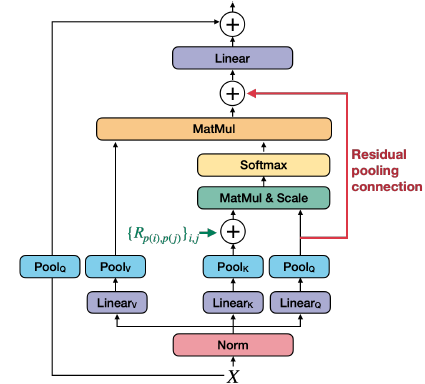

Building on MViT from the [Multiscale Vision Transformers](https://arxiv.org/pdf/2104.11227) paper, MViTv2 introduces two  improvements to pooling attention: (a) shift-invariant positional embeddings and (b) a residual pooling connection. These enhancements lead to better performance in image and video recognition tasks.

{fig-align="center"}

## Decomposed Relative Position Embeddings

Shortcoming of MViT is that it uses absolute positional embeddings, which are not shift-invariant. The interaction between two patches will change depending on their absolute positions in the image (even if their relative positions remain the same).

"Shift-invariance in vision" refers to a fundamental property where the recognition or detection of a visual feature should remain consistent regardless of where it appears in an image.
In simple terms: if you can recognize a cat in the top-left corner of an image, you should also recognize that same cat if it appears in the bottom-right corner. The object's identity doesn't change just because its absolute position in the image has changed.

They introduce **decomposed relative position embeddings**  that encode the relationship between patches (like "this patch is 2 positions to the right and 1 position down from that patch") rather than their absolute locations. This makes the model shift-invariant - it can recognize the same spatial patterns regardless of where they appear in the image.

The authors encode the relative position between two input elements, $i$ and $j$ into positional embedding $R_{p(i), p(j)} \in \mathbb{R}^d$ where $p(i)$ and $p(j)$ are the spatial position of element $i$ and $j$.

Self-Attention:

$\operatorname{Attn}(Q, K, V)=\operatorname{Softmax}\left(\left(Q K^{\top}+E^{(\mathrm{rel})}\right) / \sqrt{d}\right) V$

where

$E_{i j}^{(\mathrm{rel})}=Q_i \cdot R_{p(i), p(j)}$

$R_{p(i), p(j)}=R_{h(i), h(j)}^{\mathrm{h}}+R_{w(i), w(j)}^{\mathrm{w}}+R_{t(i), t(j)}^{\mathrm{t}}$

## Residual Pooling Connection

Asymmetric downsampling strategy: The $Q$ tensor is only downsampled when the output sequence resolution actually changes across stages, while $K$ and $V$ can be downsampled more frequently within stages. This creates an efficient attention mechanism where: You maintain fine-grained queries ($Q$) You attend over coarser keys and values ($K$, $V$)

This design makes sense because the attention output sequence $Z$ will have the same length as the pooled query $Q$ (as shown in equation 5), so you want $Q$ to control the output resolution while allowing $K$ and $V$ to be more aggressively compressed to save computation and memory.

$Z:=\operatorname{Attn}(Q, K, V)+Q$

##  MViT for Object Detection

