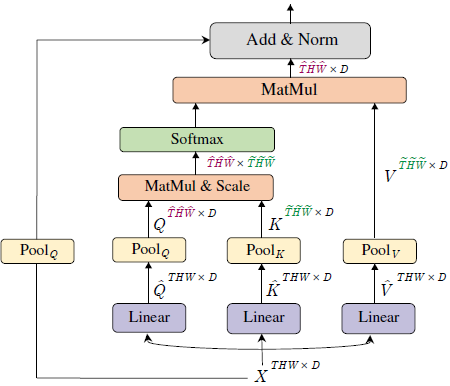
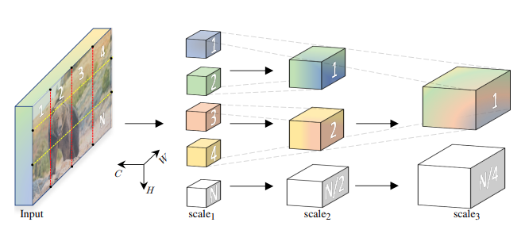

## Introduction

A summary of the Multiscale Vision Transformers (MViT) paper: [Multiscale Vision Transformers](https://arxiv.org/abs/2104.11227), focused on the model architecture and key concepts. Not focused on the experimental results. 

Multiscale Vision Transformers (MViT) is a model for video and image recognition and is heavily inspired by the Vision Transformer (ViT) architecture.

Combine **multiscale feature hierarchies** with the **transformer model**.

The model architecture is built on _stages_, which consists of multiple transformer blocks. The idea is to progressively increase the channel capacity while reducing the spatial-temporal resolution.

- Meta AI Blogpost: https://ai.meta.com/blog/multiscale-vision-transformers-an-architecture-for-modeling-visual-data/

- Video explanation from one of the authors: https://youtu.be/IG4il10zx68?si=Am5xLj5qU1QE73CW

## Multi Head Pooling Attention (MHPA):

{fig-align="center"}

Consider an input tensor $X$ that is $D$ dimensional and has a sequence length of $L$, 

$$
X \in \mathbb{R}^{L \times D}
$$

MHPA projects the input tensor $X$ into intermerdiate tensors, Query tensor $\hat{Q} \in \mathbb{R}^{L \times D}$, key tensor $\hat{K} \in \mathbb{R}^{L \times D}$ and value tensor $\hat{V} \in \mathbb{R}^{L \times D}$ with linear operations:

$$
\hat{Q}=X W_Q \quad \hat{K}=X W_K \quad \hat{V}=X W_V
$$

with weights $W_Q, W_K, W_V \in \mathbb{R}^{D \times D}$.

Intermediate tensors are then pooled in sequence length, with a pooling operator $\mathcal{P}$ as as described next.

### Pooling Operator

The pooling operator, $\mathcal{P}(\cdot ; {\Theta})$, performs a pooling kernel computation: a pooling kernel $k$ of dimensions $k_T \times k_H \times k_W$ with strides $s_T \times s_H \times s_W$ and paddings $p_T \times p_H \times p_W$.

Equation below applied coordinate-wise:
$$
\tilde{\mathbf{L}}=\left\lfloor\frac{\mathbf{L}+2 \mathbf{p}-\mathbf{k}}{\mathbf{s}}\right\rfloor+1
$$

When we apply the above equation coordinate-wise, we get:

$$
\begin{align}
\tilde{T} = \frac{T+2p_T-k_T}{s_T} + 1  \\
\tilde{H} = \frac{H+2p_H-k_H}{s_H} + 1  \\
\tilde{W} = \frac{W+2p_W-k_W}{s_W} + 1  \\
\end{align}
$$

and getting the sequence length (flattening the tensor), $\tilde{L}$,

$$
\begin{align}
\tilde{L} &=\tilde{T} \times \tilde{H} \times \tilde{W}  \\
&= \left(\frac{T+2 p_T-k_T}{s_T}+1\right) \times\left(\frac{H+2 p_H-k_H}{s_H}+1\right) \times\left(\frac{W+2 p_W-k_W}{s_W}+1\right)  \\
&\approx \frac{T H W + \dots}{s_T s_H s_W} 
\end{align}
$$

which explains the following phrase from the paper:

> $\tilde{L}$, the sequence length of the output tensor $\mathcal{P}(Y ; \Theta)$, experiences an overall reduction by a factor of $s_T s_H s_W$.

### Pooling Attention

After the pooling operator $\mathcal{P}(Y ; \Theta)$ is applied to the query, key, and value tensors, the attention operation is performed as follows:

$$
\operatorname{Attention}(Q, K, V) = \operatorname{Softmax}\left(Q K^T / \sqrt{D}\right) V
$$

where $Q = \mathcal{P}(\hat{Q} ; \Theta)$, $K = \mathcal{P}(\hat{K} ; \Theta)$, and $V = \mathcal{P}(\hat{V} ; \Theta)$.

The paper mentions, "Naturally, the operation induces the constraints $s_K \equiv s_V$ on the pooling operators." because the matrix multiplication by $V$ must be valid. For explanation, see below:

The first operation is the matrix multiplication $QK^T$. The resulting shape of this multiplication

$$
\begin{align}
Q &\in  \mathbb{R}^{L_Q \times D} \\
K^T &\in  \mathbb{R}^{D \times L_K} \\
\end{align}
$$

The result has shape $(L_Q, L_K)$. After applying softmax, you multiply by $V$.

The previous result has shape $(L_Q, L_K)$.
$V$ has shape $(L_V, D)$, so for the multiplication to be valid, $L_K$ must equal $L_V$.

and since both $K$ and $V$ are both derived from the same pooling operation, which reduces the sequence length, $L$, by the same factor, stride $s$, this means $s_K \equiv s_V$.

This point is reiterated in a later section of the paper, "Key-Value Pooling":

> Since the sequence length of key and value tensors need to be identical to allow attention weight calculation, the pooling stride used on K and value V tensors needs to be identical.

## Multiscale Transformer Networks

{fig-align="center"}

The key difference between MViT (Multiscale Vision Transformers) and ViT (Vision Transformers) is that MViT "progressively grows the channel resolution (i.e. dimension), while simultaneously reducing the spatiotemporal
resolution (i.e. sequence length) throughout the network." while ViT "maintains a constant channel capacity and spatial resolution throughout all the blocks".

### Scale Stage

Scale stage is a set of $N$ transformer blocks that operate with the same channel dimension $D$ and sequence length $L$.

At a transition of stages, the "channel dimension is upsampled (increased) while the length of the sequence is downsampled (decreased). This effectively reduces the spatio-temporal resolution of the underlying visual data while allowing the network to assimilate the processed information in more complex features".

This creates a multiscale hierarchy similar to CNNs - early stages process high-resolution spatial-temporal data with simple features (fewer channels), while later stages process lower-resolution data but with more complex, abstract features (more channels). 

If you downsample space-time resolution by 4×, you increase channels by 2×. So a resolution change from 2D × T/δₜ × H/8 × W/8 to 4D × T/δₜ × H/16 × W/16 roughly preserves computational complexity while building a hierarchical feature pyramid. This is essentially applying the CNN principle of "deeper = more channels, lower resolution" to video transformers, allowing the model to build increasingly abstract representations of the video content.

### Query Key Value (QKV) Pooling

"Unlike Query pooling, changing the sequence length of key K and value V tensors does not change
the output sequence length and, hence, the space-time resolution."

The reason is in the "Pooling Attention" section above: the attention mechanism output length is determined by the query length, $L_Q$ because the attention mechanism involves matrix multiplication of $QK^T V$, where the output has shape $(L_Q, D)$ and $L_K$ and $L_V$ is only used during matrix multiplication of $QK^T V$.

The model architecture decreases resolution at the beginning of a stage and then keeps the resolution constant within the stage, so the first pooling attention operator operates at $s^Q > 1$ while the rest have $s^Q \equiv 1$.

### Skip Connections

The last step of the "Pooling Attention" architecture shows the skip connection. The skip connection is implemented as follows: The query pooling operator $\mathcal{P}\left(\cdot ; \Theta_Q\right)$ is added, instead of the raw input $X$, to the output of the attention operation.

## Summary

Walkthrough of the entire model architecture from start to finish:

$\text{cube}_1$ stage:

The raw input data is provided as dense space-time cubes of shape $c_T \times c_H \times c_W$ and $D$ channels. Then, downsampling is applied to reduce the spatial-temporal resolution with $\text { stride } s_T \times 4 \times 4$. This results in an output of shape $D \times \frac{T}{s_T} \times \frac{H}{4} \times \frac{W}{4}$. 

$\text{scale}$ stage:

Then, the subsequent scale stages  down-sample the spatial resolution (sequence length $L$) through multiple ($N$) transformer blocks with Multi Head Pooling Attention (MHPA) and increase the channel dimension $D$ through MLP at stage transitions.

