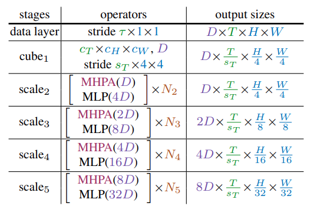

## Introduction

This post summarizes the [Multiscale Vision Transformers (MViT) paper](https://arxiv.org/abs/2104.11227) with a focus on the model architecture and does not cover experimental model performance. 

Multiscale Vision Transformers (MViT) is a model for video and image recognition and is heavily inspired by the [Vision Transformer (ViT)](https://arxiv.org/pdf/2010.11929) architecture. The main idea of MViT is to combine the multiscale feature hierarchies with the transformer model. The model architecture is built on _stages_, which consists of multiple transformer blocks. The idea is to progressively increase the channel capacity while reducing the spatial-temporal resolution.

## Multi Head Pooling Attention (MHPA):

{fig-align="center"}

Consider an input tensor $X$ that is $D$ dimensional and has a sequence length of $L$, $X \in \mathbb{R}^{L \times D}$. Sequence length $L$ is obtained by $L=T \times H \times W$, where $T$ is the temporal dimension, $H$ is the height dimension, and $W$ is the width dimension.

The first step of Multi Head Pooling Attention (MHPA) is to project the input tensor $X$ into intermediate tensors:

- Query tensor $\hat{Q} \in \mathbb{R}^{L \times D}$
- Key tensor $\hat{K} \in \mathbb{R}^{L \times D}$ 
- Value tensor $\hat{V} \in \mathbb{R}^{L \times D}$ 

via matrix multiplication of the input tensor $X$ with weights: $W_Q, W_K, W_V \in \mathbb{R}^{D \times D}$. Then, these intermediate tensors are pooled in sequence length, with a pooling operator $\mathcal{P}(\cdot ; {\Theta})$.

### Pooling Operator

The pooling operator, $\mathcal{P}(\cdot ; {\Theta})$, performs a pooling kernel computation: a pooling kernel $k$ of dimensions $k_T \times k_H \times k_W$ with strides $s_T \times s_H \times s_W$ and paddings $p_T \times p_H \times p_W$.

The below equation is applied to each dimension of the intermediate tensor ($T$, $H$, $W$):

$$
\begin{align}
\tilde{\mathbf{L}}=\left\lfloor\frac{\mathbf{L}+2 \mathbf{p}-\mathbf{k}}{\mathbf{s}}\right\rfloor+1 \\
\\
\tilde{T} = \frac{T+2p_T-k_T}{s_T} + 1  \\
\tilde{H} = \frac{H+2p_H-k_H}{s_H} + 1  \\
\tilde{W} = \frac{W+2p_W-k_W}{s_W} + 1  \\
\end{align}
$$

Once we obtain the sequence length ($L$) by multiplying all three dimensions,

$$
\begin{align}
\tilde{L} &=\tilde{T} \times \tilde{H} \times \tilde{W}  \\
&= \left(\frac{T+2 p_T-k_T}{s_T}+1\right) \times\left(\frac{H+2 p_H-k_H}{s_H}+1\right) \times\left(\frac{W+2 p_W-k_W}{s_W}+1\right)  \\
&\approx \frac{T H W + \dots}{s_T s_H s_W} 
\end{align}
$$

we can confirm the following observation about the pooling operator:

> $\tilde{L}$, the sequence length of the output tensor $\mathcal{P}(Y ; \Theta)$, experiences an overall reduction by a factor of $s_T s_H s_W$.

### Pooling Attention

After the pooling operator $\mathcal{P}(Y ; \Theta)$ is applied to the query, key, and value tensors, the attention operation is performed on $Q$, $K$, and $V$ as follows:

$$
\operatorname{Attention}(Q, K, V) = \operatorname{Softmax}\left(Q K^T / \sqrt{D}\right) V
$$

where $Q = \mathcal{P}(\hat{Q} ; \Theta)$, $K = \mathcal{P}(\hat{K} ; \Theta)$, and $V = \mathcal{P}(\hat{V} ; \Theta)$.

The authors note:

> Naturally, the operation induces the constraints $s_K \equiv s_V$ on the pooling operators

 The reason is that the matrix multiplication by $V$ at the end must be valid. The first operation is the matrix multiplication $QK^T$ where $Q \in  \mathbb{R}^{L_Q \times D}$ and $K^T \in  \mathbb{R}^{D \times L_K}$. resulting in a shape of $(L_Q, L_K)$. After applying softmax, the result is multiplied by $V$, which has shape $(L_V, D)$. For the multiplication to be valid, $L_K$ must be equal to $L_V$. Since both $K$ and $V$ are derived from the same pooling operation - which reduces the sequence length, $L$, by stride $s$ - it follows that $s_K \equiv s_V$.

This point is emphasized in a later section of the paper, _Key-Value Pooling_:

> Since the sequence length of key and value tensors need to be identical to allow attention weight calculation, the pooling stride used on K and value V tensors needs to be identical.

## Multiscale Transformer Networks

{fig-align="center"}

The key difference between MViT (Multiscale Vision Transformers) and ViT (Vision Transformers) is that MViT "progressively grows the channel resolution (i.e. dimension), while simultaneously reducing the spatiotemporal
resolution (i.e. sequence length) throughout the network." while ViT "maintains a constant channel capacity and spatial resolution throughout all the blocks".

### Scale Stage

Scale stage is a set of $N$ transformer blocks that operate with the same channel dimension $D$ and sequence length $L$. At a transition of stages, the "channel dimension is upsampled (increased) while the length of the sequence is downsampled (decreased). This effectively reduces the spatio-temporal resolution of the underlying visual data while allowing the network to assimilate the processed information in more complex features".

This creates a multiscale hierarchy similar to CNNs - early stages process high-resolution spatial-temporal data with simple features (fewer channels), while later stages process lower-resolution data but with more complex, abstract features (more channels). 

If you downsample space-time resolution by 4, you increase channels by 2. So a resolution change from $2D \times \frac{T}{δ_t} \times \frac{H}{8} \times \frac{W}{8}$ to $4D \times \frac{T}{δ_t} \times \frac{H}{16} \times \frac{W}{16}$ roughly preserves computational complexity while building a hierarchical feature pyramid. This is essentially applying the CNN principle of "deeper = more channels, lower resolution" to video transformers.

### Query Key Value (QKV) Pooling

In the _Key-Value pooling_ section, the authors write: 

> Unlike Query pooling, changing the sequence length of key K and value V tensors does not change
the output sequence length and, hence, the space-time resolution.

The reason is explained in the _Pooling Attention_ section: the attention mechanism output length is determined by the query length, $L_Q$ because the attention mechanism involves matrix multiplication of $QK^T V$, where the output has shape $(L_Q, D)$ and $L_K$ and $L_V$ is only used during matrix multiplication of $(QK^T) V$.

Also, the model architecture decreases resolution at the beginning of a stage and then keeps the resolution constant within the stage, so the first pooling attention operator operates at $s^Q > 1$ while the rest have $s^Q \equiv 1$.

### Skip Connections

The last step of Pooling Attention is the skip connection. In the skip connection, the query pooling operator $\mathcal{P}\left(\cdot ; \Theta_Q\right)$ is added, instead of the raw input $X$, to the output of the attention operation because of a dimension mismatch that occured in the initial pooling. 

## Model Architecture Walkthrough

{fig-align="center"}

Based on Table 2 in the paper (above), here is a walkthrough of the MViT architecture:

##### $\text{cube}_1$ stage:

The raw input data is provided as dense space-time cubes of shape $c_T \times c_H \times c_W$ and $D$ channels. Then, downsampling is applied to reduce the spatial-temporal resolution with $\text { stride } s_T \times 4 \times 4$. This results in an output of shape $D \times \frac{T}{s_T} \times \frac{H}{4} \times \frac{W}{4}$. 

##### $\text{scale}_i$ stages:

Then, the subsequent scale stages  down-sample the spatial resolution (sequence length $L$) through multiple ($N$) transformer blocks with Multi Head Pooling Attention (MHPA) and increase the channel dimension $D$ through MLP at stage transitions.

For more details, see:

- Meta AI Blogpost: [Multiscale Vision Transformers: A hierarchical architecture for representing image and video information](https://ai.meta.com/blog/multiscale-vision-transformers-an-architecture-for-modeling-visual-data/)

- Conference Talk: [Multiscale Vision Transformers (MViT) ICCV 2021](https://youtu.be/IG4il10zx68?si=Am5xLj5qU1QE73CW)

